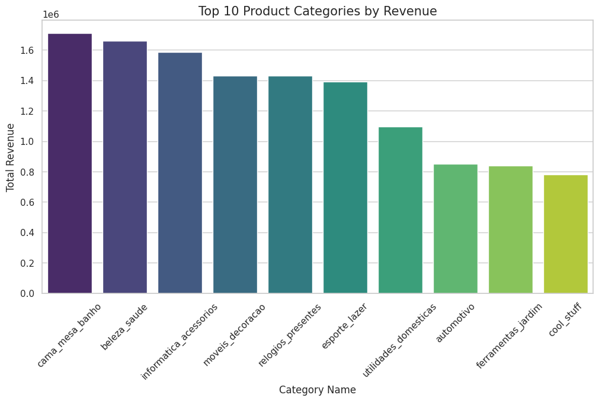

# Olist E-commerce Data Analysis Project 📊

## 📝 Project Overview
This project focuses on analyzing a public dataset from Olist, the largest department store in Brazilian marketplaces. The goal is to clean the data, merge multiple datasets, and extract actionable business insights.

## 🛠️ Tech Stack
- **Language:** Python
- **Libraries:** Pandas (Cleaning/Merging), Matplotlib & Seaborn (Visualization).

## 🚀 Key Steps Taken
1. **Data Cleaning:** Handled missing values in product categories and corrected zero-weight entries.
2. **Data Integration:** Merged `Orders`, `Items`, and `Products` datasets to create a unified data structure.
3. **Exploratory Analysis:** Analyzed payment methods, installment behaviors, and category performance.

## 📈 Top 10 Categories by Revenue
Here is the visualization of the top-performing categories we identified:

## 💡 Key Insights
- **Installment Behavior:** Large purchases correlate strongly with a higher number of payment installments.
- **Top Categories:** "Bed, Bath & Table" leads in volume, while "Watches & Gifts" shows a higher average order value.

## 📁 Files in Repository
- `Olist_EDA_Cleaning.ipynb`: The main notebook containing the full analysis code.
- `top_categories_revenue.png`: Visualization of revenue distribution.
